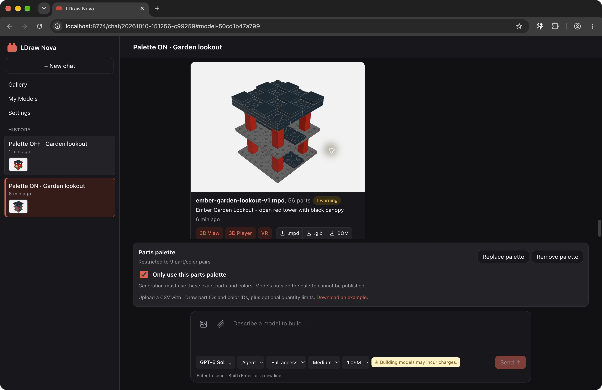
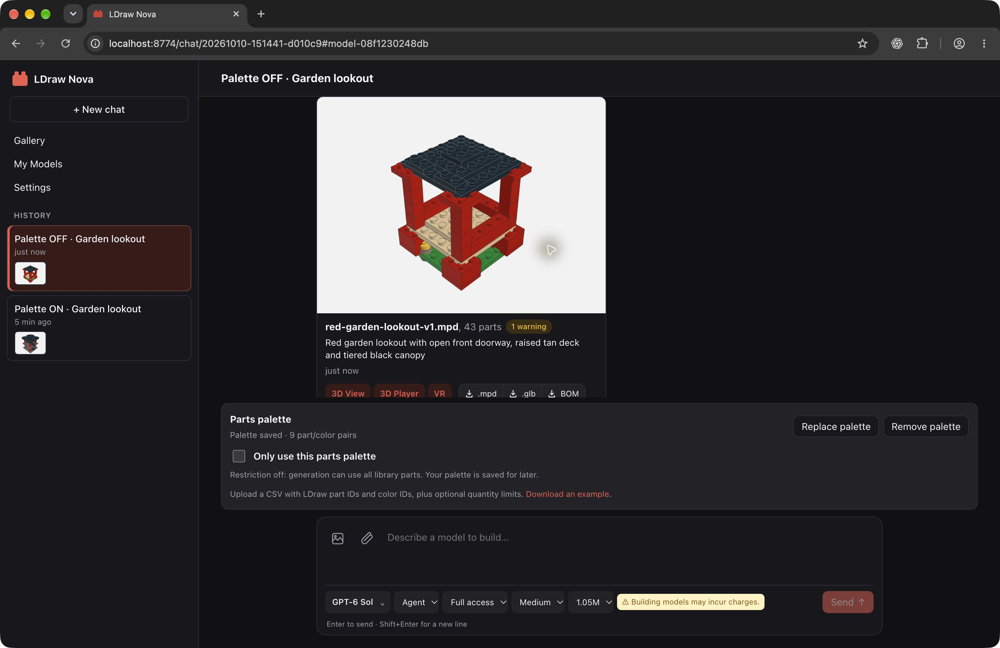
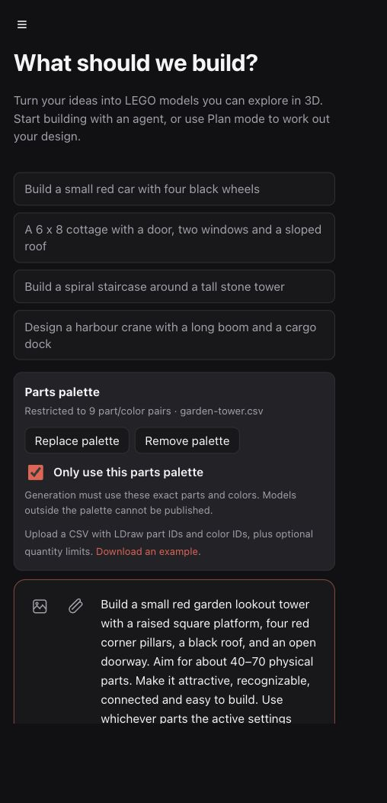
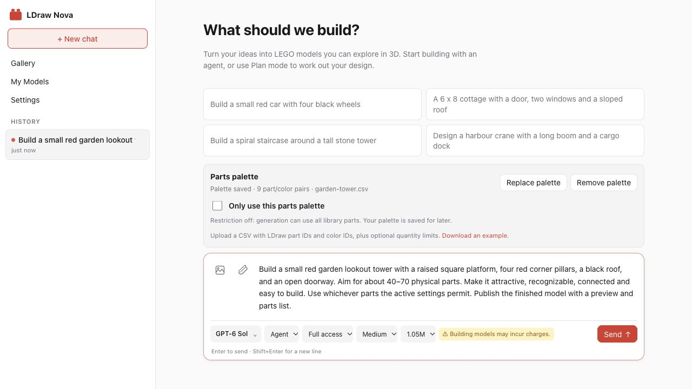

# Parts-palette generation: real on/off comparison

Generated on October 10, 2026 with the running Nova web app, the paired feature
branches, the actual LDraw library and LeoCAD. Both chats used **GPT-6 Sol**,
**medium** effort, Agent mode, Full access and the same prompt. These are real
provider-backed generations, not mocked screenshots or seeded model fixtures.

[Download the generated nine-pair palette](garden-tower.csv). It contains red
bricks, black plates/tiles and a dark gray 4×8 plate, with quantity limits.
The same CSV was uploaded through the app for both runs. The switch was checked
in the first and unchecked in the second; the disabled palette remained saved.

> Build a small red garden lookout tower with a raised square platform, four red corner pillars, a black roof, and an open doorway. Aim for about 40–70 physical parts. Make it attractive, recognizable, connected and easy to build. Use whichever parts the active settings permit. Publish the finished model with a preview and parts list.

## Independent inventory audit

The audit expands the published MPDs with the core toolkit, resolves inherited
colors and quantities, then checks them against the actual CSV. The hashes match
the server's captured publication results. The script and complete per-pair
counts are in [audit.py](audit.py) and [audit.json](audit.json).

| Setting | Published physical parts | Distinct part/color pairs | Physical parts outside palette | Palette valid, including quantity limits |
| --- | ---: | ---: | ---: | --- |
| Only use this parts palette: **on** | 56 | 4 | 0 | Yes |
| Only use this parts palette: **off** | 43 | 13 | 23 | No, as expected when unrestricted |

The unrestricted model uses omitted pairs including `3958` in green (2), tan (19)
and black (0), `3010` in red (4), and `6141` in yellow (14). Its tan deck and green
base visibly differ from the restricted model's gray plates.

The [publication gate check](publication-gate.json) attempted to publish the
unchanged unrestricted MPD through the real `publish_model` implementation in
the restricted chat. It was **blocked before publication**, and every generated
MPD kept its original hash. [check_publication_gate.py](check_publication_gate.py)
is the reproducible direct tool invocation. No extra LLM request was made for
this rejection test.

## Screenshots from the actual app

The result captures include the published preview, BOM count, saved nine-pair
palette and checkbox state. They were taken after reloading the chats, also
verifying that both selection states persist.

**Restricted: 56 parts, all permitted.**



**Unrestricted: 43 parts, including 23 outside the palette.**



The initial settings captures show the identical prompt and uploaded CSV at a
458-pixel mobile layout, without horizontal overflow:





## Files and reproduction

The `restricted/` and `unrestricted/` folders contain the published MPD, real
render, LeoCAD BOM, editable plan, generation script, validation/build reports,
BOM comparison and visual review. [run-settings.json](run-settings.json) records
the identical prompt and turn settings. Neither chat's private configuration nor
provider credentials are included.

Build the paired `codex/selectable-parts-palette` branches. Upload
`garden-tower.csv` on New chat, keep the restriction selected, and send the prompt
above. Start another chat, upload the same CSV, uncheck the restriction, and send
the same prompt. Model geometry can vary between generations; the restricted
publication must always pass the exact inventory check.

To audit these captured example files inside the web container:

```sh
PYTHONPATH=/opt/ldraw-nova /opt/ldraw-nova/.venv/bin/python \
  /app/examples/parts-palette/audit.py /opt/ldraw/ldraw \
  /app/examples/parts-palette/restricted/ember-garden-lookout-v1.mpd \
  /app/examples/parts-palette/unrestricted/red-garden-lookout-v1.mpd

PYTHONPATH=/app/web/backend:/app python3 \
  /app/examples/parts-palette/check_publication_gate.py RESTRICTED_CHAT_ID \
  /app/examples/parts-palette/unrestricted/red-garden-lookout-v1.mpd
```

For the second command, select an idle chat where this CSV is uploaded and the
restriction is enabled. The test removes its temporary candidate after checking.

Both models pass source/geometry validation and their BOMs agree with LeoCAD.
The ordinary physical-buildability warning remains: the connector graphs have
incomplete confirmed evidence (one optimistic group restricted, nine unrestricted).
Palette membership is verified independently of that existing limitation.
Semantic searches timed out during the actual runs; the agents continued with
local parts inspection and offline search.

Validation for the feature: **30 core tests, 195 backend tests, 9 frontend tests**
passed, as did the TypeScript/Vite build and `git diff --check`.
